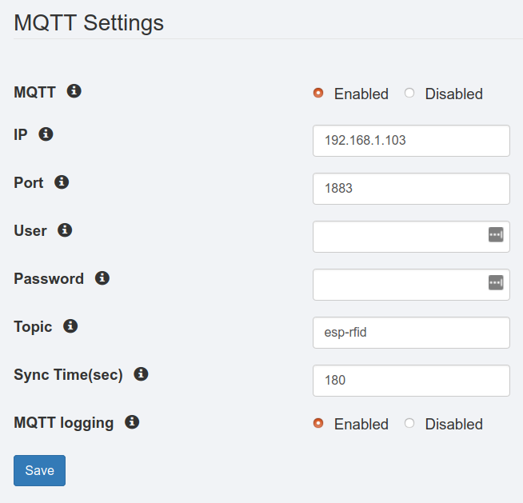

# ESP RFID with extended MQTT Functions

Hardware:
* Any esp-rfid board like esp-rfid-relay-board, marelab ESP-DOOR

This has been added so far:
* Reading all user data over MQTT
* Sending User data to RFID-DOOR/ESP-RFID over MQTT
* Sending door open command over MQTT
* Sending door status over MQTT as event
* Sending Sync of a RFID-DOOR (IP/Hostname) over MQTT
* Configure Sync interval over ESP-RFID GUI
* Deleting all User of a ESP-RFID device over MQTT
* Sending log event & access data over MQTT
* Demo NODE-RED flow & GUI to centralize managment of ESP-RFID devices & users

## Broker settings
You can add all the broker details in the web UI:



## Using MQTT Topics
For the MQTT communication some additional TOPICs have been added internally. The default Topic is configured in the web UI. If you use more then one device, every device should have the same `TOPIC` name configured. All MQTT communication is done with JSON Payload as MQTT Message.

This is the used Topic hierarchy:

```
TOPIC---+---/sync
          |
          +---/send
          |
          +---/accesslist
```

  e.g. if you configure in the web UI `TOPIC` = "/rfid" these topic queues can be used:
  * /rfid
  * /rfid/sync
  * /rfid/send
  * /rfid/accesslist

## Commands received by ESP-RFID
The message format is JSON.

The message has to include the IP of the device together with one of the supported commands:

### getuser
Receive a list of all users over `TOPIC/accesslist`
JSON command format:
```
{
   cmd:'getuser',
   doorip:'(The ESP-RFID IP address as String)'
}
```
JSON return format:
```
{
    "command": "userfile",
    "uid": "1234",
    "user": "User Name",
    "acctype": 1,
    "acctype2": null,
    "acctype3": null,
    "acctype4": null,
    "validuntil": 1608336000
}
```

### listusr
Receive a list of all users over `TOPIC/send`
JSON command format:
```
{
    cmd:'listusr',
    doorip:'(The ESP-RFID IP address as String)'
}
```
JSON return format:
```
{
    "command": "userfile",
    "uid": "1234",
    "user": "User Name",
    "acctype": 1,
    "acctype2": null,
    "acctype3": null,
    "acctype4": null,
    "validuntil": 1608336000
}
```

### opendoor
Opens the Door/Magnetic Lock.

JSON command format:
```
{
    cmd:'opendoor',
    doorip:'(The ESP-RFID IP of the door to open as String)'
}
```

### deletusers
Delete all User SPIF files over `TOPIC`.

JSON command format:
```
{
     cmd:'deletusers',
     doorip:'(The ESP-RFID IP address as String)'
}
```

### adduser
Adds a User as SPIF File to the device over `TOPIC`.

JSON command format:
```
{
     cmd:'adduser',
     doorip:'(The ESP-RFID IP address as String)'
     uid: '(The PIN as String)',
     user: '(User Name as String)',
     acctype: 1,
     validuntil: 1608466200
}
```
* _acctype_
  * 0 = Disabled
  * 1 = Always
  * 99 = Admin

* _validuntil_
  * Expiration date/time as Unix epoch timestamp

## Messages sent by ESP-RFID
ESP-RFID sends a set of MQTT messages for the most significant actions that it does, plus can be configured to send all the logs over MQTT, instead of keeping them locally.

All the messages are sent at the topic: `TOPIC/send`.

### Base messages

#### boot
Once booted and connected to the WiFi, it sends this message.

JSON format:
```
{
  "type":"boot",
  "time":1605987212,
  "Wifi SSID":"xxx",
  "Local IP":"192.168.1.xxx"
}
```

#### heartbeat
Every X seconds ESP-RFID sends a heartbeat over MQTT. The interval can be customised in the web UI, the default is 180 seconds.

JSON format:
```
{
  "type":"heartbeat",
  "time":1605991375,
  "ip":"192.168.1.xxx",
  "door":"your esp-rfid hostname"
}
```

#### publish_access
When a RFID token is detected a set of messages can be sent, depending on the presence of the token UID in the database.

If the UID is in the users list, there can be a set of possible "access" configurations. It can be:

* `Admin` for admin users
* `Always` for access enabled
* `Disabled` for access disabled
* `Expired` for access expired

JSON format:
```
{
  "type":"access",
  "time":1605991375,
  "isknown":"true",
  "access":"the access state",
  "username":"username",
  "uid":"token UID",
  "door":"your esp-rfid hostname"
}
```
If instead the UID is not present in the users list the message will be:

JSON format:
```
{
  "type":"access",
  "time":1605991375,
  "isknown":"false",
  "access":"Denied",
  "username":"Unknown",
  "uid":"token UID",
  "door":"your esp-rfid hostname"
}
```

### Log messages

Besides the above messages, ESP-RFID can send all the logs via MQTT instead of storing those locally. If this is enabled via the web UI, also the following messages are sent.

### Door status

If the door sensor is enabled, two messages are sent, one when the door is opened:

```
{
  "type":"INFO",
  "src":"door",
  "desc":"Door Open",
  "data":"",
  "time":1605991375,
  "cmd":"event",
  "door":"your esp-rfid hostname"
}
```

And one when the door is closed:

```
{
  "type":"INFO",
  "src":"door",
  "desc":"Door Closed",
  "data":"",
  "time":1605991375,
  "cmd":"event",
  "door":"your esp-rfid hostname"
}
```

### Doorbell

If the doorbell is enabled, a message is sent when it's ringing:

```
{
  "type":"INFO",
  "src":"doorbell",
  "desc":"Doorbell ringing",
  "data":"",
  "time":1605991375,
  "cmd":"event",
  "door":"your esp-rfid hostname"
}
```

Besides these two messages that have to do with interactive devices, the other messages are system status logging.
